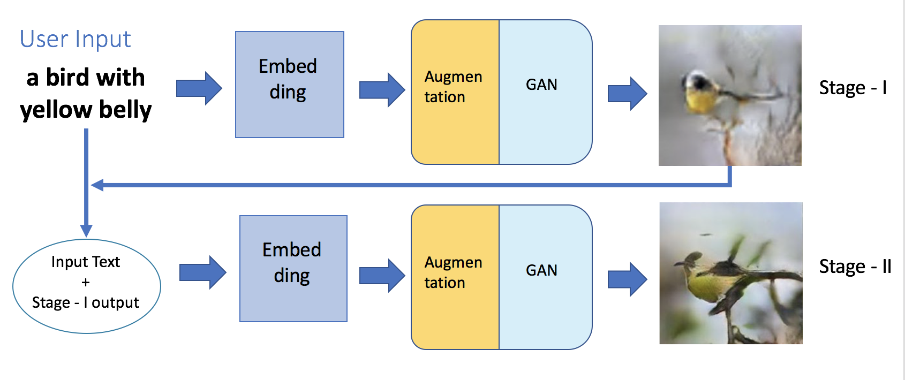
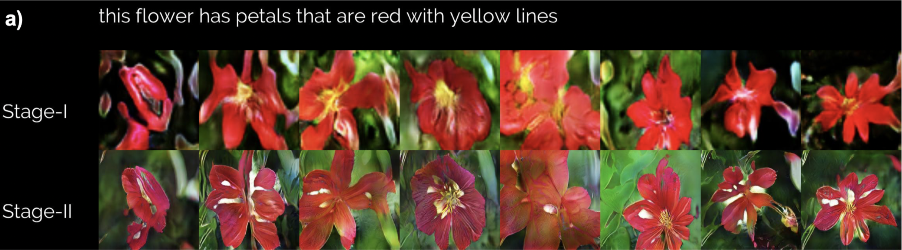
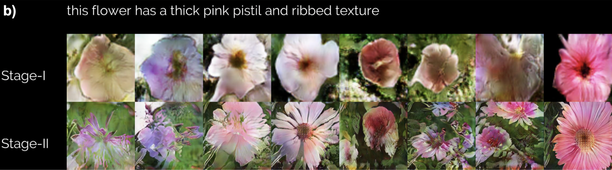
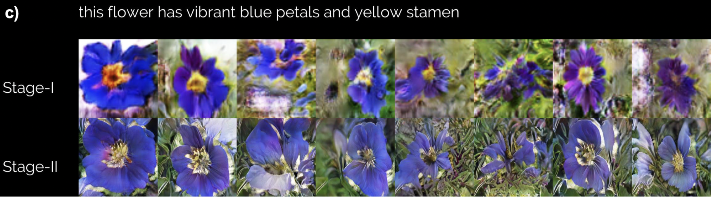
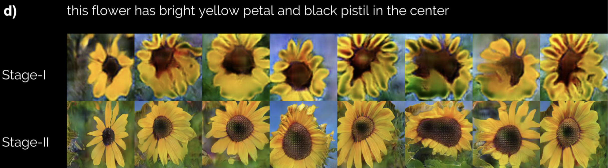
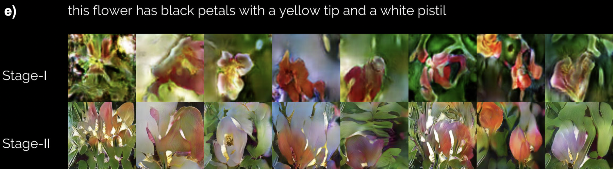
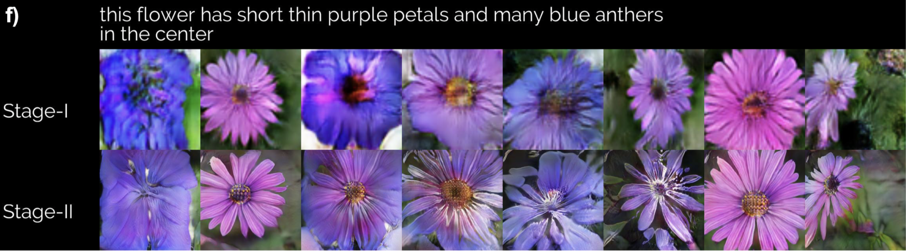

# StackGAN

Modified and integrate the code of StackGAN, in generating images according to user inputs. 




Using stackGAN, the model can generate photo-realist high-resolution images based on text input.


### Dependencies

python 2.7

zip
unzip
tensorflow-gpu==1.0.1
prettytensor
progressbar
python-dateutil
easydict
pandas
torchfile
imageiogoogledrivedownloader


### Results














### Running Instructions

##### environment setup

install the packages in `requirement.txt` by 

```shell
pip install -r requirements.txt
```


##### training

download data and do pre-processing

```
mkdir Data
python prepare_data.py
```

training

```
python stageI/run_exp.py –cfg stageI/cfg/flowers.yml
python stageII/run_exp.py –cfg stageII/cfg/flowers.yml
```

test

download the encoder, unpack and put it in `demo/text_encoder` , run

```
sh demo/flowers_demo.sh
```

The results are stored at StackGAN/Data/flowers/example_captions


### Reference

* StackGAN: Text to Photo-realistic Image Synthesis with Stacked Generative Adversarial Networks [Paper](https://arxiv.org/pdf/1612.03242v1.pdf) [Code](https://github.com/hanzhanggit/StackGAN)

- Generative Adversarial Text-to-Image Synthesis [Paper](https://arxiv.org/abs/1605.05396) [Code](https://github.com/reedscot/icml2016)
- Learning Deep Representations of Fine-grained Visual Descriptions [Paper](https://arxiv.org/abs/1605.05395) [Code](https://github.com/reedscot/cvpr2016)